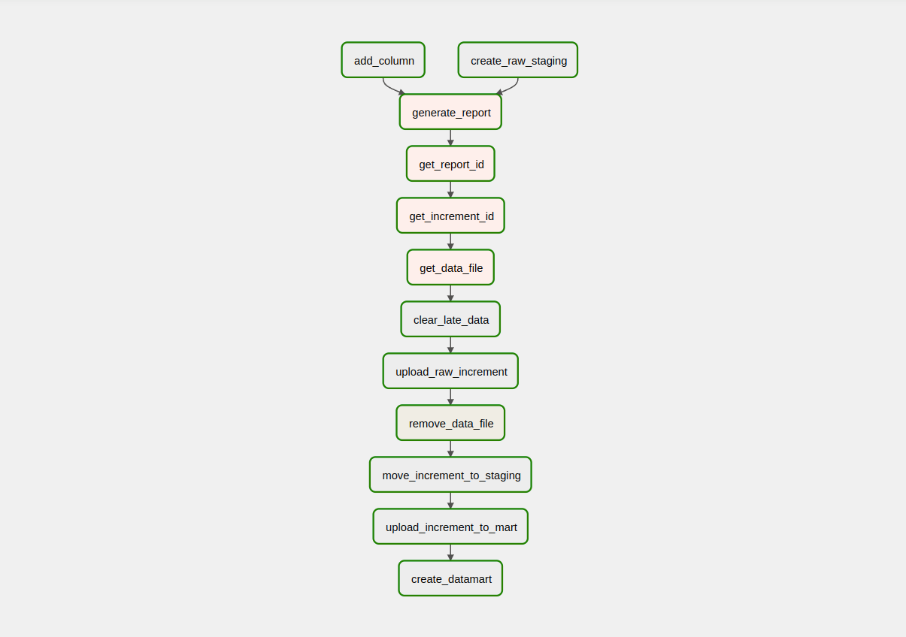

## Пайплайн выполняется ежедневно (00:00 UTC) и включает в себя следующие этапы:

| Задача                              | Описание                                                                                                                                                                                                                                                                                                                                                                                                                                                                                                                                                                 |
|-------------------------------------|--------------------------------------------------------------------------------------------------------------------------------------------------------------------------------------------------------------------------------------------------------------------------------------------------------------------------------------------------------------------------------------------------------------------------------------------------------------------------------------------------------------------------------------------------------------------------|
| 1.1. `task_create_raw_staging`      | Проверка наличия в staging таблиц для загрузки сырых данных из файла `user_orders_log_inc.csv`: `staging.user_order_log_raw` и `staging.user_order_log_raw_with_status`. Если таблицы отсутствуют, то они создаются.                                                                                                                                                                                                                                                                                                                                                     |
| 1.2. `task_generate_report`         | Проверка наличия поля `status` в таблицах `staging.user_order_log` и `mart.f_sales`. Если поле `status` в таблицах отсутствует, то оно создается.                                                                                                                                                                                                                                                                                                                                                                                                                        |
| 2. `task_generate_report`           | Обращение к внешнему источнику, получение «task_id».                                                                                                                                                                                                                                                                                                                                                                                                                                                                                                                     |
| 3. `task_get_report_id`             | Обращение к внешнему источнику, получение «report_id».                                                                                                                                                                                                                                                                                                                                                                                                                                                                                                                   |
| 4. `task_get_increment_id`          | Обращение к внешнему источнику, получение «increment_id».                                                                                                                                                                                                                                                                                                                                                                                                                                                                                                                |
| 5. `task_get_data_file`             | Загрузка файла `user_orders_log_inc.csv` из внешнего хранилища (s3) за логическую дату выполнения задачи. Проверка наличия поля `status` в загруженном файле, на основании этого выбор таблицы для загрузки в staging.                                                                                                                                                                                                                                                                                                                                                   |
| 6. `task_clear_late_data`           | Удаление данных из таблиц `mart.f_sales`, `staging.user_order_log`, `staging.user_order_log_raw`, `staging.user_order_log_raw_with_status` за логическую дату выполнения задачи для обеспечения идемпотентности.                                                                                                                                                                                                                                                                                                                                                         |
| 7. `task_upload_raw_increment`      | Загрузка данных из файла `user_orders_log_inc.csv` в таблицу, выбранную на этапе 5.                                                                                                                                                                                                                                                                                                                                                                                                                                                                                      |
| 8. `task_remove_data_file`          | Удаление файла `user_orders_log_inc.csv` за логическую дату выполнения задачи.                                                                                                                                                                                                                                                                                                                                                                                                                                                                                           |
| 9. `task_move_increment_to_staging` | Перемещение данных из таблиц `staging.user_order_log_raw` и `staging.user_order_log_raw_with_status` в таблицу `staging.user_order_log` за логическую дату выполнения задачи.                                                                                                                                                                                                                                                                                                                                                                                            |
| 10. `task_upload_increment_to_mart` | Заполнение таблиц `mart.d_item`, `mart.d_customer`, `mart.d_city`, `mart.f_sales` данными из `staging.user_order_log` за логическую дату выполнения задачи и с учетом требований бизнеса.                                                                                                                                                                                                                                                                                                                                                                                |
| 11. `task_create_datamart`          | Создание (обновление) витрины `mart.f_customer_retention` для расчета метрик customer retention с разбивкой по неделям. Витрина содержит следующие поля: `week_of_year` — номер недели; `new_customers_count` — кол-во новых клиентов; `returning_customers_count` — кол-во вернувшихся клиентов; `refunded_customer_count` — кол-во уникальных клиентов, оформивших возврат; `purchase_refunds_count` — кол-во возвратов; `new_customers_revenue` — доход от новых клиентов; `returning_customers_revenue` — доход от вернувшихся клиентов. |

## DAG:

## Скрипты:                  

> [DAG (пайплайн)](src/DAG/upload_increment_data.py)

> [SQL-запросы](migrations)   
